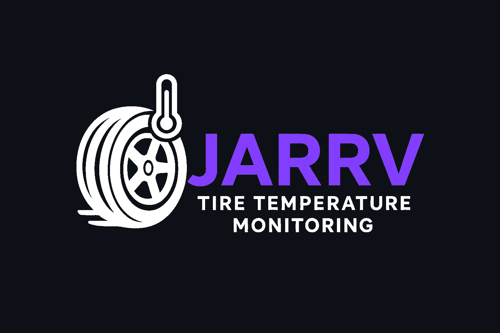

# JARRV

  <picture>
    <source srcset="imagens/LogoJARRVofc-dark.png" media="(prefers-color-scheme: dark)" />
    <source srcset="imagens/LogoJARRVofc.png" media="(prefers-color-scheme: light)" />
    
  </picture>

 

  
  
  

 

## Certificadora de Competência - EC46H - 2025/2

### Integrantes
| Alunos |
|:--------|
| [Arthur Henrique Jardim](https://github.com/arthur-hj) |
| [João Alberto Benaci](https://github.com/k7vinilstorage) |
| [Rafael Munhoz Castro](https://github.com/RafinhaW74) |
| [Vinícius Souza Dias](https://github.com/vinicius-10) |

 

## Sumário
| Documentação |
|:--------|
| [Requisitos Funcionais](https://github.com/k7vinilstorage/Tire-temperature-monitor/blob/main/Requisitos%20de%20usu%C3%A1rio/Requisitos%20Funcionais.md) |
| [Requisitos Não Funcionais](https://github.com/k7vinilstorage/Tire-temperature-monitor/blob/main/Requisitos%20de%20usu%C3%A1rio/Requisitos%20Nao%20Funcionais.md) |
| [Histórias de Usuário](https://github.com/k7vinilstorage/Tire-temperature-monitor/blob/main/Requisitos%20de%20usu%C3%A1rio/Historias%20de%20Usuarios.md) |
| [Protótipo de Alta Fidelidade](https://github.com/k7vinilstorage/Tire-temperature-monitor/blob/main/Prot%C3%B3tipo%20de%20alta%20fidelidade/Link%20para%20prot%C3%B3tipo.md) |
| [Requisitos de Sistema](https://github.com/k7vinilstorage/Tire-temperature-monitor/blob/main/Requisitos%20de%20Sistema/Descri%C3%A7%C3%A3oPasta.md) |
| [Código Fonte](https://github.com/vinicius-10/certificadora/tree/main/C%C3%B3digo) |

 

## Objetivo
Desenvolver um sistema de monitoramento de temperatura de pneus para o protótipo do projeto de extensão **Fórmula CP**, utilizando sensores infravermelho e um microcontrolador. O objetivo é enviar as leituras dos sensores para o sistema de telemetria já existente do projeto e projetar uma interface gráfica para visualização desses dados.

## Público-Alvo
O público-alvo do projeto são os membros do projeto de extensão do Fórmula CP e entusiastas da área automotiva.

## Sobre o Sistema
### Tire Temperature Monitor
O sistema consiste em 4 sensores de temperatura infravermelho (GY906) conectados a um microcontrolador ESP32-C3 Mini e um módulo CAN MCP2551. 

O sistema realizará a leitura dos sensores de temperatura e enviará os dados para o sistema de telemetria já existente via rede CAN. Além disso, será implementada uma interface gráfica em Java para apresentar os dados recebidos de forma amigável.
